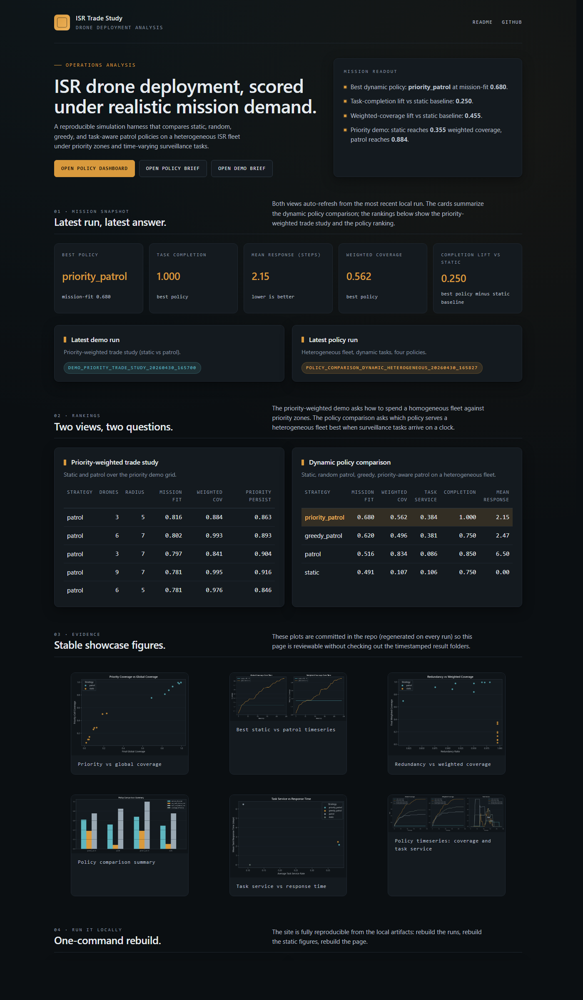

# ISR Drone Deployment Trade Study

[](https://github.com/joshleh/isr-drone-deployment-trade-study/actions/workflows/pages.yml)
[](https://joshleh.github.io/isr-drone-deployment-trade-study/)
[](https://www.python.org/)
[](LICENSE)

A reproducible simulation harness that scores ISR drone deployment policies against coverage, persistence, cost, and dynamic-task response — with a heterogeneous fleet, time-varying surveillance demand, and an analyst-style live demo on top.

[](https://joshleh.github.io/isr-drone-deployment-trade-study/)

This repo is the operations-analysis sibling of two ML-focused projects:

- [`AeroTrack`](https://github.com/joshleh/aerotrack) — multi-object detection + tracking on aerial drone footage.
- [`FusionTrack`](https://github.com/joshleh/fusiontrack) — multi-sensor EKF + Hungarian MOT for radar / camera fusion.

Where AeroTrack and FusionTrack are end-to-end ML systems, this one is the offline evaluation and decision-support layer that surrounds those systems: scenario design, KPI engineering, sweep analysis, policy comparison, and reporting.

---

## What it does

- Simulates **static**, **random patrol**, **greedy patrol**, and **task-aware patrol** policies on configurable 2D grid scenarios.
- Models a **heterogeneous fleet** (long-endurance `sentinel` + faster `scout`) under **priority zones** and **dynamic surveillance tasks** that appear and expire on a clock.
- Scores every run on coverage, weighted coverage, persistence, redundancy, task service, response time, and a configurable composite mission-fit score.
- Persists each run as **CSV + Parquet + DuckDB**, plus a per-run **static HTML dashboard** and a markdown analyst brief.
- Renders a single **live-demo page** that pulls together the latest priority-weighted demo and dynamic policy comparison and ships to GitHub Pages.

---

## Live demo

[joshleh.github.io/isr-drone-deployment-trade-study](https://joshleh.github.io/isr-drone-deployment-trade-study/)

The Pages workflow regenerates every artifact on every push:

- runs the unit tests
- runs the priority-weighted demo and the dynamic policy comparison
- rebuilds the live-demo HTML and dashboard
- deploys the entire `docs/` + `results/` tree

So the deployed site is always live numbers from a fresh end-to-end run, not a hand-curated screenshot.

---

## Headline policies

| Policy | What it does | When it wins |
| --- | --- | --- |
| `static` | Fixed loiter points. | Holding a small set of high-value cells with perfect persistence. |
| `patrol` | Random walk patrol. | Maximizing cumulative weighted coverage when demand is uniform. |
| `greedy_patrol` | Assigns each drone to the highest-utility candidate every step. | Reactive task response with a clean baseline against random patrol. |
| `priority_patrol` | Task-aware planner with target commitment and platform-aware fit. | Composite score and task completion under shifting mission demand. |

Stable showcase figures live in [`docs/figures/`](docs/figures) and back the live-demo gallery.

---

## Repository layout

```text
isr-drone-deployment-trade-study/
├── configs/                       # scenario, sweep, and policy YAMLs
│   ├── base.yaml
│   ├── demo_priority.yaml
│   ├── advanced_ops_base.yaml
│   ├── policy_comparison_heterogeneous.yaml
│   └── sweeps/
├── docs/
│   ├── 00_project_overview.md
│   ├── 01_problem_statement.md
│   ├── 02_modeling_assumptions.md
│   ├── 03_experiments_plan.md
│   ├── 04_results_summary.md
│   ├── 05_demo_walkthrough.md
│   ├── 06_role_alignment.md
│   ├── 07_dynamic_policy_comparison.md
│   ├── figures/                   # stable showcase plots, committed
│   └── live_demo/                 # generated site (auto-built)
├── scripts/
│   ├── run_pipeline.py            # single-run smoke test
│   ├── run_sweep.py               # parameter sweep (fleet x radius x strategy)
│   ├── run_demo.py                # priority-weighted trade study
│   ├── run_policy_comparison.py   # heterogeneous fleet, dynamic tasks, 4 policies
│   ├── export_results.py          # sweep -> docs/figures
│   └── build_live_demo.py         # render docs/live_demo/index.html
├── src/isr_trade_study/
│   ├── analytics/                 # DuckDB + Parquet persistence
│   ├── dashboard/                 # shared HTML theme + per-run + live-demo builders
│   ├── io/                        # YAML config loading
│   ├── sim/                       # scenario types + Monte Carlo runner
│   ├── utils/                     # rng helpers
│   └── viz/                       # matplotlib helpers
├── tests/test_simulation.py
├── .github/workflows/pages.yml    # CI: build + deploy live demo
├── Makefile
├── pyproject.toml
└── README.md
```

---

## How to run

Use Python `3.10+`. A project-local virtualenv or Conda env is the safer choice — do not change the machine-wide default just for this repo.

```bash
# 1. install
python -m pip install -e .

# 2. unit tests
make test

# 3. priority-weighted trade study (static vs patrol)
make demo

# 4. dynamic policy comparison (heterogeneous fleet, 4 policies)
make policy

# 5. build the live demo from the latest local artifacts
make live-demo

# 6. serve the repo so the live demo is reachable in a browser
make serve-demo
# then open http://127.0.0.1:8010/docs/live_demo/index.html
```

`make help` lists every target. On Windows, run the underlying `python scripts/...` commands directly if you do not have `make` installed.

---

## Outputs

Per-run artifacts land under `results/<workflow>/<timestamp>/`:

| File | Workflow | Purpose |
| --- | --- | --- |
| `*_results_raw.csv` | all | One row per individual seed. |
| `*_results_agg.csv` | all | Mean across seeds, grouped by strategy / fleet mix / config. |
| `analysis.duckdb` | sweep, policy | DuckDB database holding the same tables. |
| `*.parquet` | sweep, policy | Parquet copies for downstream BI / notebooks. |
| `dashboard.html` | policy | Static dashboard sharing the live-demo theme. |
| `*_report.md` | demo, policy | Markdown analyst brief for the run. |
| `*_timeseries.csv` | demo, policy | Coverage / weighted-coverage / task-service over time. |

Stable showcase figures land under `docs/figures/` and are committed so the README and live demo render without any results checked out.

---

## Configuration

Every scenario, sweep, and policy comparison is described declaratively in YAML.

- [`configs/base.yaml`](configs/base.yaml) — minimal homogeneous baseline.
- [`configs/demo_priority.yaml`](configs/demo_priority.yaml) — priority-weighted scenario with a border corridor, an ingress lane, and a logistics hub.
- [`configs/advanced_ops_base.yaml`](configs/advanced_ops_base.yaml) — heterogeneous fleet (`sentinel` + `scout`) with four dynamic surveillance tasks.
- [`configs/sweeps/`](configs/sweeps) — parameter sweeps across fleet size and sensor radius.
- [`configs/policy_comparison_heterogeneous.yaml`](configs/policy_comparison_heterogeneous.yaml) — strategy list and `mission_fit_score` weights for the dynamic policy comparison.

Tweak a YAML, rerun the workflow, regenerate the live demo, ship.

---

## Documentation

The `docs/` tree is the long-form companion to this README:

- [`00_project_overview.md`](docs/00_project_overview.md) — what the project does and how it is structured.
- [`01_problem_statement.md`](docs/01_problem_statement.md) — formal problem definition, decision variables, and KPIs.
- [`02_modeling_assumptions.md`](docs/02_modeling_assumptions.md) — explicit assumptions and limitations.
- [`03_experiments_plan.md`](docs/03_experiments_plan.md) — workflows, factors, and reporting.
- [`04_results_summary.md`](docs/04_results_summary.md) — qualitative findings and tradeoffs.
- [`05_demo_walkthrough.md`](docs/05_demo_walkthrough.md) — priority-weighted demo walkthrough.
- [`06_role_alignment.md`](docs/06_role_alignment.md) — how the project maps to operations-analyst / data-scientist / data-engineer / autonomy-evaluation work.
- [`07_dynamic_policy_comparison.md`](docs/07_dynamic_policy_comparison.md) — dynamic policy comparison details.

---

## Disclaimer

This project is an independent analytical study for educational and portfolio purposes. It does not represent operational systems, real-world ISR deployments, or proprietary methodologies of any organization.
